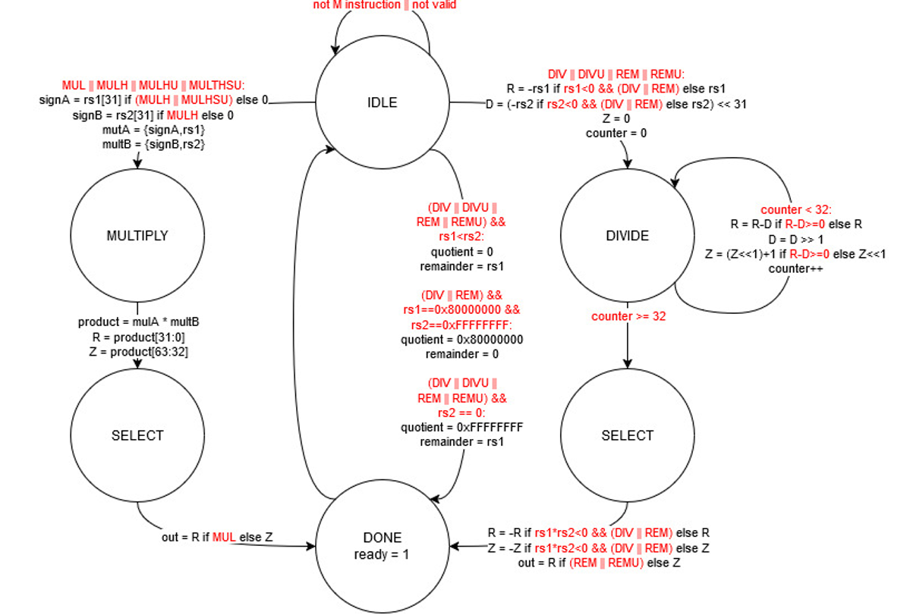
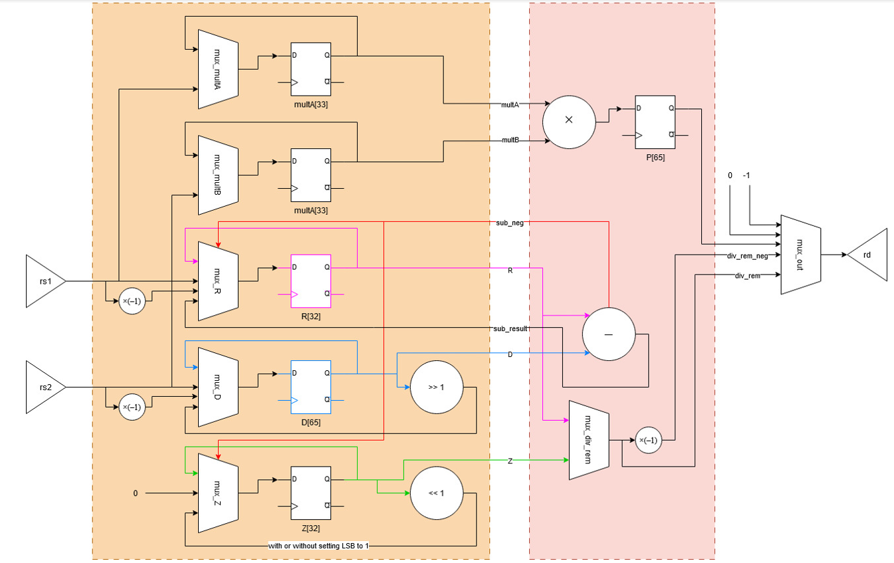

# RISC-V M Extension Co-Processor

Custom Implementation of Multiplication and Division Instructions

## Overview

This project implements the **M extension** of the RISC-V instruction set as a **co-processor** designed to handle multiplication and division operations. The design splits the implementation into two distinct components: a **control path** and a **data path**, each fulfilling a dedicated role in executing the arithmetic instructions.

**NOTE:** This unit was already built by me independently before this project and that is why it is written in SystemVerilog as compared to the other modules. The origial repo for the code can be found at [RISCV-Custom-M-Unit-Extension](https://github.com/TalhaIsrar/RISCV-Custom-M-Unit-Extension)

---

## Architecture

### Signal Interface Description

| Signal   | Direction | Width   | Description                                                                                                                                               |
|----------|-----------|---------|-----------------------------------------------------------------------------------------------------------------------------------------------------------|
| `valid`      | Input     | 1 bit   | Set by the processor when an unknown instruction is discovered. `insn`, `rs1`, and `rs2` are assigned at the same time.                                  |
| `insn`       | Input     | 32 bits | Holds the unknown instruction; assigned simultaneously with `valid`.                                                                                      |
| `rs1`        | Input     | 32 bits | Holds the value of register `rs1` from the instruction `insn`.                                                                                            |
| `rs2`        | Input     | 32 bits | Holds the value of register `rs2` from the instruction `insn`.                                                                                            |
| `rd`         | Input     | 5 bits  | Holds the number of target register `rd` from the instruction `insn`.                                                                                            |
| `ready`      | Output    | 1 bit   | Set by the co-processor to signal that instruction execution is complete and outputs are ready. High for **only one clock cycle**, otherwise causes error. |
| `wr`         | Output    | 1 bit   | Set by the co-processor simultaneously with `ready` if the instruction has a result to return.                                                           |
| `result`     | Output    | 32 bits | Holds the result value when `wr` is set.                                                                                                                  |
| `busy`       | Output    | 1 bit   | Indicates instruction is being processed.        |
| `result_dest`| Output    | 5 bit   | Register in the Register file where we have to write to.        |

### 🔧 Control Path

The control path is governed by a finite state machine (FSM) with the following states:

* **IDLE**: Waits for the activation signal from the main core.
* **MULTIPLY**: Performs multiplication based on multiplication type.
* **DIVIDE**: Performs division in multiple cycles based on bitwise divison algorithm.
* **SELECT**: Select the correct register to put into output.
* **DONE**: Signals the main core the completion of the multiplication/division.



### 🧮 Data Path

The data path consists of:

* A **register file** for holding operands and results.
* An **ALU** for performing arithmetic operations.
* A control signal `sub_reg` from the ALU to the register file to manage operand routing.



---

### 32-Bit Signed/Unsigned Division Algorithm
The code uses an optimized version of the algorithm presented below:

**Inputs:**
- `A`, `B`: 32-bit signed/unsigned integers
- `FUNC3`: 3-bit control signal (determines `DIV` or `REM` operation)

**Outputs:**
- `Z`: Quotient (32-bit signed/unsigned integer)
- `R`: Remainder (32-bit signed/unsigned integer)

The algorithm ensures:  
> **A = Z × B + R**

---

```pseudocode
begin
    if (FUNC3 == DIV or FUNC3 == REM) then
        signA ← A[31]
        signB ← B[31]

        if (signA) then
            A ← ~A + 1     // Convert to absolute value
        end if

        if (signB) then
            B ← ~B + 1     // Convert to absolute value
        end if
    end if

    R ← A
    B ← {0, B, ZERO_31}    // Left shift B by 31 bits (align divisor)
    Z ← 0

    for i = 0 to 31 do
        Z ← Z << 1
        if (R - B ≥ 0) then
            Z ← Z + 1
            R ← R - B
        end if
        B ← B >> 1
    end for

    if (FUNC3 == DIV or FUNC3 == REM) then
        if (signA XOR signB) then
            Z ← ~Z + 1     // Apply sign to quotient
        end if
        if (signA) then
            R ← ~R + 1     // Apply sign to remainder
        end if
    end if

    return Z, R
end

```

---

## Testbenches

-> **Co-Processor Testbench**

   * **Multiplication Tests**:

     * Positive × Positive
     * Negative × Positive
     * Maximum possible values (overflow scenarios)
   * **Division & Remainder Tests**:

     * Positive ÷ Positive
     * Negative ÷ Positive
     * Division by zero
     * Dividend < Divisor (Quotient = 0, Remainder = Dividend)
     * Division of minimum negative number by -1 (overflow)

### ⏱️ Cycle Measurements

| Operation Type                      | Cycle Count |
| ----------------------------------- | ----------- |
| Multiplication                      | 4           |
| Division/Remainder (Normal Case)    | 34          |
| Division/Remainder (Exception Case) | 1           |

---

## FPGA Resource Utilization

**Target Board: Nexys A7-100T (Artix-7)**

These utilizations are independant of the RV32I considering the module as independant

| Resource        | Utilization |
| --------------- | ----------- |
| DSP Blocks      | 4           |
| Slice LUTs      | 596         |
| Slice Registers | 203         |
| BRAM            | 0           |

---

## Timing Analysis

These timings are independant of the RV32I considering the module as independant

| Parameter                    | Value    |
| ---------------------------- | -------- |
| **Clock Frequency**          | 100 MHz  |
| **Setup Slack (WNS)**        | 1.088 ns |
| **Hold Slack (WHS)**         | 0.137 ns |
| **Pulse Width Slack (WPWS)** | 4.5 ns   |

---

## 📄 License

This project is released under the MIT License.

---

## 🤝 Contributions

Contributions, suggestions, and issue reports are welcome! Feel free to fork and open pull requests.

---

*Created by Talha Israr*  
